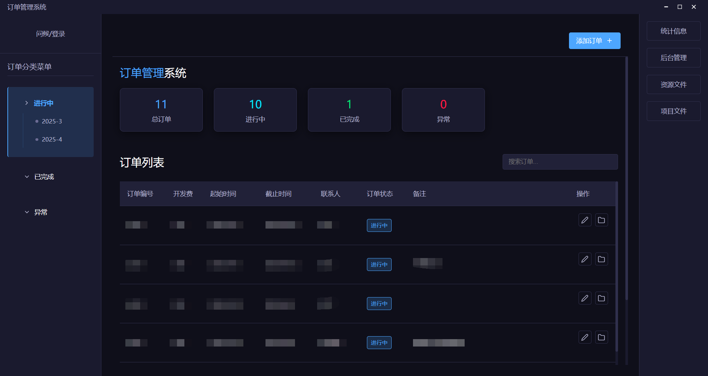
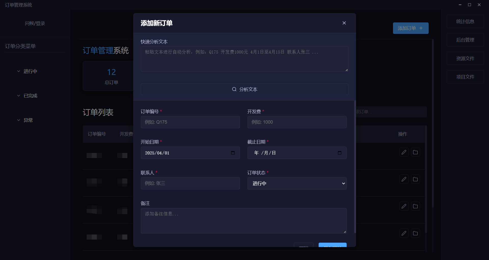

# AutoOrder：程序员接单一体化工具

> 🚧 本项目为测试性开发，约 90% 由 AI 自动生成，用于探索 AI + 多端接单平台的可行性。

---

## ✦ 项目简介

AutoOrder 致力于打造一个多端部署、一站式解决「从接单 ➝ 项目管理 ➝ 收益统计」的自动化平台。

**当前已实现功能：**

- ✅ 订单管理（CRUD）
- ✅ 打开资源文件
- ✅ 文本智能识别填入（基于正则表达式）
- ✅ 人性化布局与操作流程优化
- ✅ 已接入后端服务，支持完整数据流转

---

## ✦ 界面预览

### 主页面视图

---

### 添加页面（文本分析功能）

---

## ✦ 技术栈

本项目已实现前后端联动，整体架构如下：

- **Electron + Vue 3**：构建跨平台桌面客户端
- **Vite**：前端构建工具，支持热更新
- **Node.js + Express**：后端服务，提供订单等核心接口
- **Axios**：前后端通信（RESTful API）

后端代码独立维护，详见：

👉 [AutoOrder-Server (后端仓库)](https://github.com/DmLeaves/AutoOrder-Server)

---

## ✦ 开发计划

未来版本将探索以下方向：

- 多端部署（桌面、Web）
- 用户与项目权限体系
- 收益统计与可视化报表
- 与第三方平台集成（如 GitHub、工单系统等）

---

欢迎提出建议或提交 PR，项目仍处于早期迭代阶段。
